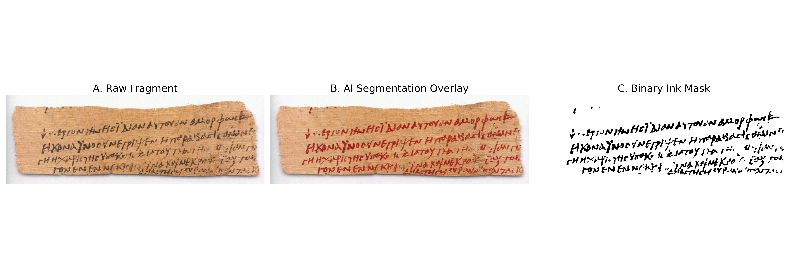

# Vesuvius Challenge: Ink Detection & Masking

## Basic Information
* **Author:** Romain Frossard
* **Supervisor:** Prof. Frédéric Kaplan (Digital Humanities Laboratory - DHLAB)
* **Academic Year:** 2025-2026 (Spring Semester)

## About
This project was developed at the École Polytechnique Fédérale de Lausanne (EPFL) as part of a master's semester project. It provides a highly robust computer vision pipeline and a resulting dataset of over 800 binary ink masks derived from historical papyrus fragments (sourced from the Duke University and Oslo Archives). Initially designed to overcome the 2D masking bottleneck for 3D synthetic data generation in the **Vesuvius Challenge**, this tool isolates true carbon ink from degraded plant fibers to provide pixel-perfect ground truth.

## Research Summary
The extraction of clean 2D inputs from heavily degraded historical manuscripts is a formidable computer vision challenge. Deterministic mathematical filters (like Sauvola thresholding) often fail due to severe illumination variances and structural noise. 

To solve this, our pipeline leverages a deep learning framework:
1. **Feature Extraction:** We utilize a frozen Vision Foundation Model (**NVlabs/RADIO v2.5-l**). By upscaling input patches, each spatial token maps to a highly localized 4x4 pixel area, preserving microscopic ink features.
2. **Segmentation:** A custom Multi-Layer Perceptron (MLP) head processes the dense embeddings, trained with a specialized hybrid Dice-BCE loss function to heavily penalize the erasure of faint strokes.
3. **Post-Processing:** A hybrid bounded hysteresis binarization algorithm safely translates continuous sub-pixel probabilities into crisp, structural masks, successfully rejecting physical edge artifacts and hallucinated background fibers.

Evaluated on a Leave-One-Out Cross-Validation (LOOCV) protocol, the model achieves a Mean Recall of 97.72% and a Mean IoU of 81.44%.



## Post-Report Updates: The Digital Microscope (256px)

While the attached semester report (`report/report.pdf`) outlines the baseline theoretical methodology and validation (LOOCV focused on 512px patches for maximum global context), the final production pipeline has been structurally optimized for deployment:

- **The Resolution Dilemma:** We identified a trade-off between semantic context (512px) and local precision (256px). 
- **Production Inference:** The final production model (`Ink_masking_model_256.pth`) operates strictly on **256px patches** with a 50% spatial overlap during inference. Because the ViT token grid is fixed, shrinking the physical patch size acts as a **digital microscope**, doubling the local prediction density. This prevents character merging (the "baveux" effect) and ensures the razor-sharp isolation of the calligraphy's microscopic *ductus*.
- **Data Scale:** The final weights provided in this repository were trained on the entire expanded corpus to maximize feature richness, moving beyond the initial LOOCV control subset.

## Repository Structure

```text
vesuvius-ink-detection/
├── README.md
├── LICENSE
├── requirements.txt
├── data/                       # Empty by default (store datasets on local NVMe/scratch)
├── images/                     # Contains figures for this README
├── lib/                        # Core Pipeline Scripts (CLI Executables)
│   ├── dataset_builder.py      # CLAHE preprocessing and HDF5 feature extraction
│   ├── inference.py            # Sliding window inference & hybrid post-processing
│   ├── metadata_merger.py      # Harmonizes Duke/Oslo datasets & scrapes web archives
│   └── train.py                # Dual-strategy training engine (Async/Preload)
├── notebooks/                  # Interactive Visualizations & Data Provenance
│   ├── 00_Data_Collection_and_Scraping.ipynb
│   └── 01_Inference_Demo.ipynb
├── report/                     # Official semester project milestone document
│   └── report.pdf
└── weights/                    # Pre-trained pipeline weights
    ├── Ink_masking_model_256.pth   # High-precision production model (Microscope approach)
    └── Ink_masking_model_512.pth   # High-context validation model (Baseline)
```

## Installation
This project requires Python 3.10+ and a CUDA-enabled GPU for efficient feature extraction and training.

1. Clone the repository:
```bash
git clone https://github.com/yourusername/vesuvius-ink-detection.git
cd vesuvius-ink-detection
```

2. Install dependencies:
```bash
pip install -r requirements.txt
```
*Note: To ensure maximum performance with PyTorch 2.0+ compilation, please install the appropriate PyTorch version for your specific CUDA drivers via the [official PyTorch website](https://pytorch.org/get-started/locally/).*

## Usage (Command Line Interface)

The core functionalities are encapsulated in the `lib/` directory and can be executed directly from the terminal.

### 1. Standardizing the Dataset
To unify the Duke and Oslo raw datasets, generate sequential surrogate IDs, and fetch missing metadata:
```bash
python lib/metadata_merger.py \
    --duke_csv data/raw/duke_meta.csv \
    --duke_img data/raw/duke_images \
    --oslo_meta data/raw/oslo_meta \
    --oslo_img data/raw/oslo_images \
    --out_dir data/Unified_Dataset
```

### 2. Building the HDF5 Embedding Database
To extract macroscopic patches, apply CLAHE, and generate the NVlabs/RADIO feature embeddings:
```bash
python lib/dataset_builder.py \
    --img_dir data/Unified_Dataset/images \
    --mask_dir data/Unified_Dataset/masks \
    --hdf5_out data/training_features.h5
```

### 3. Model Training
The training script supports two memory-management strategies: `preload` (for lighter datasets) and `async` (for massive datasets requiring chunked NVMe streaming).
```bash
python lib/train.py \
    --hdf5_path data/training_features.h5 \
    --weights_dir weights/ \
    --strategy async \
    --batch_size 262144
```

### 4. Full Resolution Inference
To generate clean binary masks and quality-control overlays from new, unseen papyrus scans using the high-precision 256px model:
```bash
python lib/inference.py \
    --img_dir data/test_scans \
    --weights weights/Ink_masking_model_256.pth \
    --out_dir results/
```

## Exploratory Notebooks
For interactive demonstrations, exploratory data analysis, and visual debugging, please refer to the `notebooks/` directory. `01_Inference_Demo.ipynb` provides a step-by-step visual breakdown of the sliding window and hybrid post-processing methodology.


## Acknowledgments & Data Provenance
The historical papyrus images utilized for the visual demonstrations and exploratory notebooks in this repository are sourced from the Duke University Libraries Digital Collections. We gratefully acknowledge their contribution to open research:

* **Demo Image (055.tif):** Papyrus P.Duk.inv. 196, David M. Rubenstein Rare Book & Manuscript Library, Duke University.
* **Panel Demonstration (figure_1.png):** Papyrus P.Duk.inv. 765, David M. Rubenstein Rare Book & Manuscript Library, Duke University.

## Generative AI Acknowledgement
The author acknowledges the use of Large Language Models (LLMs) during this project. AI tools were utilized as developmental assistants for tasks such as drafting code and utility scripts, refactoring, and formatting documentation (including this README). The core mathematical architecture, dataset curation, training pipeline logic, and scientific analysis remain the original, independent work of the author.

## License

This project is licensed under the MIT License - see the [LICENSE](LICENSE) file for details.

---
dhlab-vesuvius-ink-masking - Romain Frossard  
Copyright (c) 2026 EPFL  
This program is licensed under the terms of the MIT License.
